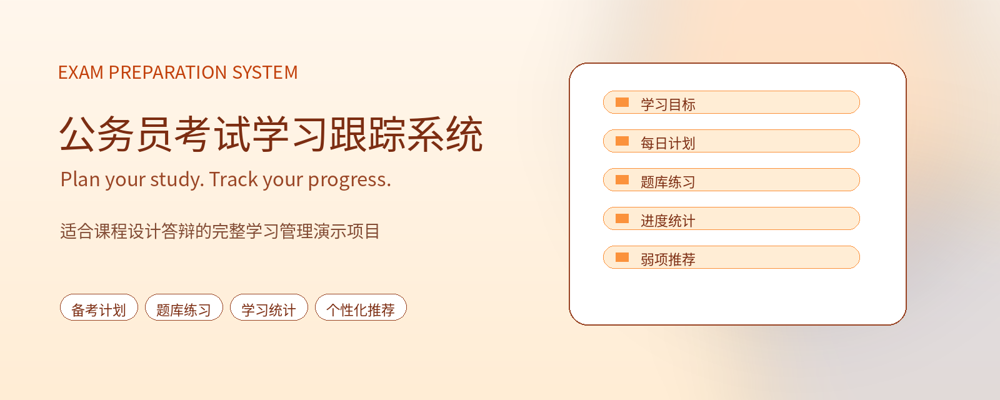
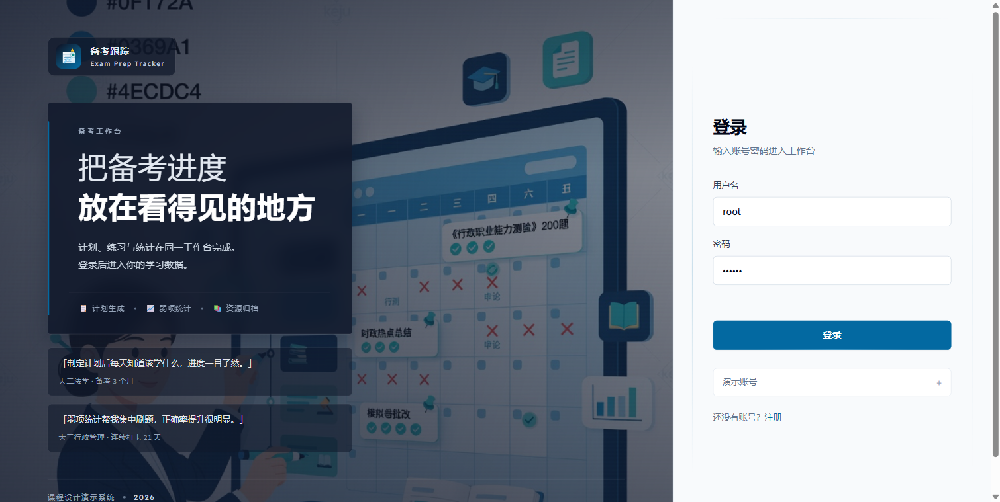
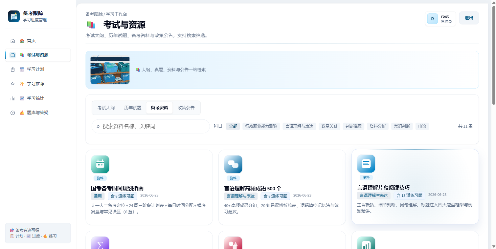
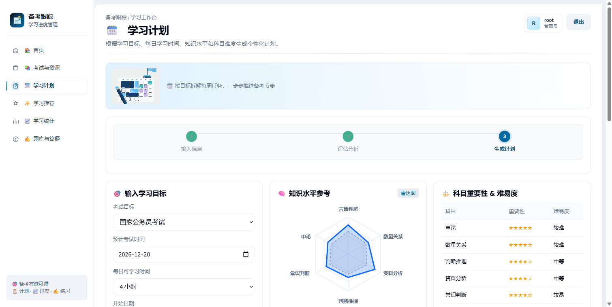
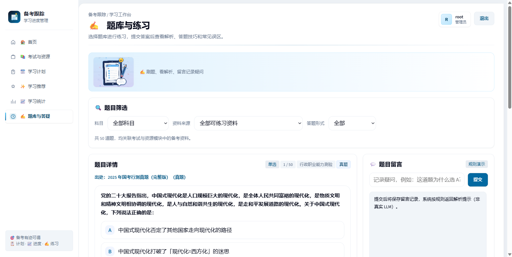
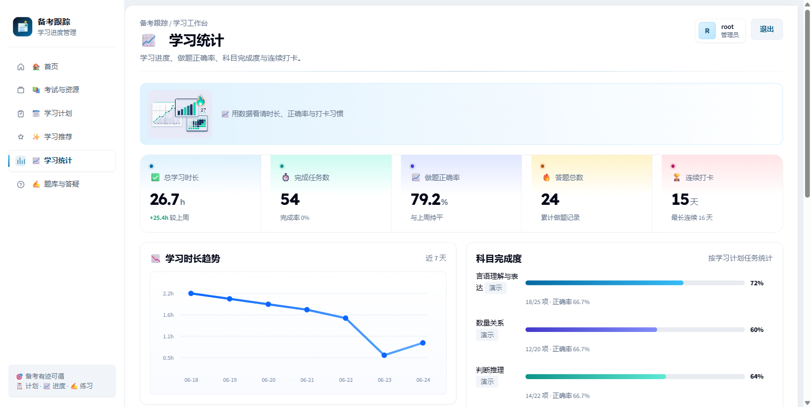
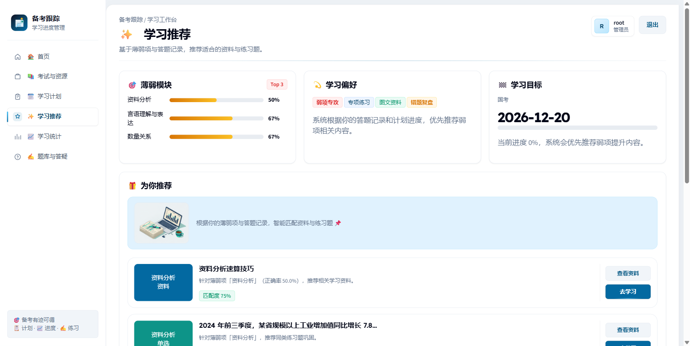
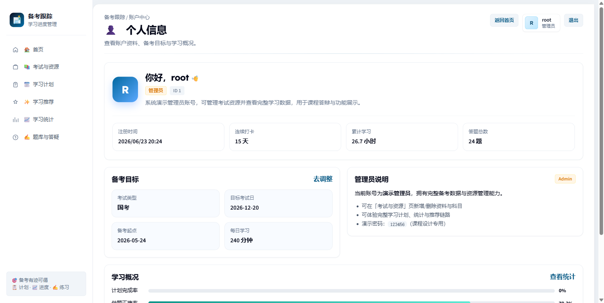
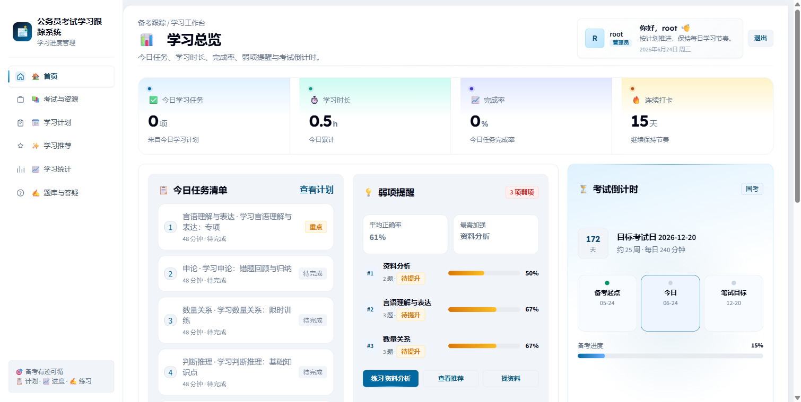

<p align="center">
  <h1 align="center">公务员考试学习跟踪系统</h1>
  <p align="center"><em>把零散的自学，变成可量化、可跟踪的备考节奏</em></p>
  <p align="center">面向大一、大二学生的轻量级公务员备考工具。系统围绕「目标 → 计划 → 练习 → 反馈」闭环：用户设定备考目标后，自动生成每日学习计划，在 <strong>200 道题库</strong>中练习答题，依据正确率识别弱项，并给出个性化资源与同类题推荐。技术栈：<strong>Flask + MySQL + 原生 HTML/CSS/JS</strong>，前后端分离、开箱即跑，专为课程设计答辩打磨。</p>
</p>

<p align="center">
  
</p>

<p align="center">
  
  
  
  
  
  <a href="https://github.com/Aafff623/civil-service-exam-tracker"></a>
</p>

<p align="center">
  <a href="#功能">功能</a> · <a href="#演示">演示</a> · <a href="#快速开始">快速开始</a> · <a href="#架构">架构</a> · <a href="#api-参考">API 参考</a> · <a href="#路线图">路线图</a> · <a href="#文档">文档</a> · <a href="#许可证">许可证</a>
</p>

---

## 为什么需要本系统

公务员考试内容庞杂、备考周期长，大学生自学时普遍遇到：

- 缺乏系统计划，复习内容东一榔头西一棒槌
- 进度难以量化，不知道自己「学到哪了、学得怎么样」
- 薄弱环节难以识别，时间花在已经会的地方
- 资料零散，不知道下一步该练什么题、看什么资源

**系统的核心闭环：**

| 组件 | 职责 |
| -------------- | -------------------------------- |
| 用户与目标 | 设定备考类型、起止日期、每日可用时长 |
| 计划生成引擎 | 按备考周期与弱项，生成每日学习任务 |
| 题库与练习 | 200 道单选 / 多选 / 判断题作答，记录对错 |
| 进度统计 | 完成率、正确率，按科目识别弱项 |
| 推荐引擎 | 规则驱动，针对正确率最低的科目推荐资源与同类题 |
| 题目解析与答疑 | 题目解析展示 + 留言（规则回复） |

```text
设定学习目标 → 生成每日计划 → 题库练习答题 → 统计与弱项识别
  → 个性化推荐 → 题目解析答疑
```

---

## 功能

| 功能 | 说明 |
| ------------------- | ------------------------------ |
| **用户与账户** | 注册、登录（Session/Cookie 鉴权）、个人信息与学习目标设定 |
| **考试资源管理** | 23 条备考资源，支持按科目 / 类型筛选与详情查看 |
| **智能学习计划** | 按备考周期与弱项生成每日任务，可逐项标记完成 |
| **题库与练习** | 200 题单选 / 多选 / 判断，支持科目、题型、关联资源筛选 |
| **学习进度跟踪** | 完成率、正确率统计与图表可视化 |
| **个性化推荐** | 基于弱项（正确率 + 科目权重）推荐资源与同类题目 |
| **题目解析与答疑** | 题目解析展示 + 答疑留言，规则化自动回复 |

**业务边界（Out of scope）：** 真实考试报名、支付 / 会员系统、多设备实时同步、AI 模型驱动的智能推荐、移动端原生 App —— 课程设计聚焦学习闭环本身，规则推荐即可演示完整价值。

---

## 演示

### Demo 账号

启动后访问 `http://localhost:8080/login.html`，以下账号密码均为 `123456`：

| 用户名 | 角色 | 说明 |
| -------- | ---- | -------------------- |
| **root** | admin | 数据最全，**答辩演示首选** |
| testuser1 | user | 有完整计划与答题记录 |
| testuser2 | user | 接近新用户空状态 |
| testuser3 | user | 少量答题，便于演示弱项推荐 |

> 推荐演示路径：登录 → 考试与资源 → 资源详情 → 开始练习 → 学习统计 → 学习推荐，一条线走完完整学习闭环。

### Showcase — 系统界面

真实系统截图（点击缩略图可放大）：

| | | |
|:---:|:---:|:---:|
| [](assets/theme/ppt/screenshots/login.png)<br><br>**登录 / 注册**<br>Session 鉴权 · 品牌化登录页 | [](assets/theme/ppt/screenshots/resources.png)<br><br>**考试资源**<br>23 条资源 · 科目 / 类型筛选 | [](assets/theme/ppt/screenshots/plan.png)<br><br>**学习计划**<br>按周期与弱项生成每日任务 |
| [](assets/theme/ppt/screenshots/qa.png)<br><br>**题库练习**<br>200 题 · 单选 / 多选 / 判断 | [](assets/theme/ppt/screenshots/statistics.png)<br><br>**学习统计**<br>完成率 · 正确率 · 弱项识别 | [](assets/theme/ppt/screenshots/recommendations.png)<br><br>**个性化推荐**<br>针对最弱科目推荐资源与题目 |
| [](assets/theme/ppt/screenshots/profile.png)<br><br>**个人中心**<br>个人信息与学习目标 | [](assets/theme/ppt/screenshots/dashboard.png)<br><br>**学习仪表盘**<br>目标、进度、答疑数据总览 | |

### 答辩材料

| 材料 | 路径 |
|---|---|
| 答辩 PPT | [`assets/theme/ppt/公务员考试学习跟踪系统答辩.pptx`](assets/theme/ppt/公务员考试学习跟踪系统答辩.pptx) |
| 阶段汇报（Week 1 / 2 / 3） | [`assets/theme/ppt/`](assets/theme/ppt/) |
| 关键决策 | [`docs/adr/0001-key-decisions.md`](docs/adr/0001-key-decisions.md) |

---

## 快速开始

### 方式一：无数据库一键演示（推荐答辩/换机）

如果目标机器没有 MySQL，或只需要快速演示前端交互，可直接使用 **Mock 模式**：

```powershell
# Windows 双击运行
quickstart-mock.bat

# 或手动启动前端静态服务
cd frontend
python -m http.server 8080
```

打开浏览器访问 http://localhost:8080/login.html?mock=1，账号 `root / 123456`。  
无需安装 MySQL、无需启动 Flask，前端 Mock fallback 覆盖全部页面与核心交互（资源浏览、计划打卡、题库练习、统计、推荐等）。

### 方式二：完整前后端启动

#### 前置环境

| 组件 | 版本建议 | 备注 |
|------|----------|------|
| Python | 3.10+ | 运行 Flask 后端 |
| MySQL | 8.0+ | 本地或远程均可 |
| Git | 任意近期版本 | 拉取代码与同步更新 |
| 现代浏览器 | Chrome / Edge / Firefox | 访问前端页面 |

> 依赖均为纯 Python 包（Flask、PyMySQL 等），通常**不需要** C++ Build Tools。

#### 三步跑起来

```powershell
# 1. 获取代码
git clone https://github.com/Aafff623/civil-service-exam-tracker.git
cd civil-service-exam-tracker

# 2. 配置 MySQL（复制模板并填写密码）
copy backend\.env.example backend\.env
#   编辑 backend\.env：MYSQL_PASSWORD=你的密码

# 3. 安装依赖 + 初始化数据库（删表重建，导入 200 题 + 23 资源）
cd backend
python -m pip install -r requirements.txt
python init_db.py
```

#### 开机运行（两个终端）

```powershell
# 终端 A — 后端（端口 5001）
cd backend
python app.py

# 终端 B — 前端静态站（端口 8080）
cd frontend
python -m http.server 8080
```

打开浏览器：

| 地址 | 说明 |
|------|------|
| http://localhost:8080/login.html | 登录页（`root / 123456`） |
| http://localhost:5001/api/health | 后端健康检查 |

<details>
<summary>答辩机换机实测检查清单</summary>

#### Mock 模式快速验证（无 MySQL）

- [ ] 双击 `quickstart-mock.bat` 启动前端，自动打开浏览器
- [ ] 访问 `http://localhost:8080/login.html?mock=1` 能打开登录页
- [ ] 用 `root / 123456` 登录，进入 dashboard
- [ ] 题库与练习页：分别筛选「单选 / 多选 / 判断」均有题目
- [ ] 判断题选项显示为「正确 / 错误」，提交后可正常判分
- [ ] 完成计划任务、查看统计、浏览推荐页无报错

#### 完整环境验证（含 MySQL + Flask）

- [ ] 安装 Python 3.10+、MySQL 8.0+、Git
- [ ] `git clone` 本项目
- [ ] 复制 `backend/.env.example` → `backend/.env` 并填写 MySQL 密码
- [ ] `cd backend && python -m pip install -r requirements.txt`
- [ ] `cd backend && python init_db.py` 成功，输出数据库名与 SQL 路径
- [ ] 启动后端 `python app.py`，确认监听 5001
- [ ] 启动前端 `python -m http.server 8080`，确认监听 8080
- [ ] 访问 `http://localhost:5001/api/health` 返回成功
- [ ] 访问 `http://localhost:8080/login.html` 能打开登录页
- [ ] 用 `root / 123456` 登录，走完「资源 → 练习 → 统计 → 推荐」路径

</details>

<details>
<summary>日常维护规范</summary>

| 操作 | 命令 | 说明 |
|------|------|------|
| 重置数据库 | `cd backend && python init_db.py` | 清空数据并重新导入种子 |
| 审计题库分布 | `cd backend && python _audit_questions.py` | 查看各科目题型数量 |
| 从 HTML 重新生成题目 SQL | `cd backend && python seed_questions_from_html.py && python patch_init_db.py` | 更新 `db/seed/init_db.sql` |
| 改题后同步到答辩机 | `git add db/seed/init_db.sql && git commit && git push` | 答辩机 `git pull` 后重新 `init_db.py` |

**重要提醒：**

- 演示数据的唯一数据源是 `db/seed/init_db.sql`，**不要**拷贝本机 MySQL 数据文件到另一台电脑
- 后端 `backend/database.db` 已在 `.gitignore`，不会提交
- 修改表结构后必须重新执行 `init_db.py`

</details>

<details>
<summary>常见问题（FAQ）</summary>

**Q：换机后题库为空？**
A：未执行 `python init_db.py`，或 `.env` 连错库。登录后看 `GET /api/questions` 是否有数据。

**Q：前端能开但接口 401 / 连不上？**
A：确认后端在 5001 运行；`frontend/js/api.js` 中 `API_BASE_URL` 为 `http://localhost:5001/api`。

**Q：改题目后另一台机没更新？**
A：需提交并推送 `db/seed/init_db.sql`，另一台 `git pull` 后重新 `init_db.py`。

**Q：需要 SQLite 吗？**
A：不需要。当前栈为 **MySQL + PyMySQL**。

</details>

---

## 架构

```text
Frontend (原生 HTML/CSS/JS, :8080)
  → Flask REST API (:5001)
    → Auth / Session 鉴权（filesystem session, scrypt 密码哈希）
    → Blueprints: resources · subjects · questions · answers
                  plans · progress · recommendations · comments
    → MySQL 8.0（PyMySQL）
    → 统一响应 { success, data, message }
```

| 层 | 技术 | 运行 |
| -------- | ------------------------------------------------ | ----------------------------- |
| 前端 | 原生 HTML/CSS/JS（无框架） | `python -m http.server 8080` |
| 后端 | Python · Flask 3.0 · Flask-Cors · Session 认证 | `python app.py`（端口 5001） |
| 数据库 | MySQL 8.0+ · PyMySQL | `init_db.py` 一键导入种子 |

**关键原则：**

- 登录后才能访问个人计划、答题与进度数据（Session/Cookie 鉴权）
- 一个用户同时只有一个有效学习计划；重新生成会覆盖旧计划
- 弱项识别仅在某科目答题样本 **≥ 5 题**时生效
- 推荐优先针对正确率最低的科目（规则驱动，非 ML）
- 密码使用 **scrypt** 哈希存储，绝不保存明文

领域词汇与业务规则详见 [`CONTEXT.md`](CONTEXT.md)。

---

## API 参考

统一前缀 `/api`，统一响应格式 `{ success, data, message }`。

### 认证与用户

| Endpoint | Method | 说明 |
| ----------------------------------- | ------ | --------------------------- |
| `/api/auth/register` | POST | 注册 |
| `/api/auth/login` | POST | 登录（写入 Session） |
| `/api/auth/logout` | POST | 退出登录 |
| `/api/auth/me` | GET | 当前登录用户 |

### 资源 · 科目 · 题库

| Endpoint | Method | 说明 |
| ----------------------------------- | ------ | --------------------------- |
| `/api/resources` | GET | 资源列表（科目 / 类型筛选） |
| `/api/resources/{id}` | GET | 资源详情 |
| `/api/subjects` | GET | 科目列表 |
| `/api/questions` | GET | 题目列表（科目 / 题型 / 资源筛选） |
| `/api/questions/{id}` | GET | 题目详情 |
| `/api/answers` | POST | 提交答案并判分 |
| `/api/answers/history` | GET | 答题历史 |

### 计划 · 进度 · 推荐 · 答疑

| Endpoint | Method | 说明 |
| ----------------------------------- | ------ | --------------------------- |
| `/api/plans/goal` | GET/POST | 读取 / 设定学习目标 |
| `/api/plans/generate` | POST | 生成学习计划 |
| `/api/plans/items` | GET | 每日计划项 |
| `/api/plans/items/{id}` | PATCH | 标记计划项完成 |
| `/api/progress` | GET | 学习进度统计 |
| `/api/recommendations` | GET | 弱项推荐（资源 + 同类题） |
| `/api/comments` | GET/POST | 题目答疑留言 |
| `/api/health` | GET | 健康检查 |

契约真相源：`backend/routes/*.py` · `backend/models.py` · `backend/init_db.py`

<details>
<summary>curl 验证示例（本地）</summary>

健康检查（无需登录）：

```powershell
curl.exe http://localhost:5001/api/health
```

登录并保存会话 Cookie，再读取当前用户：

```powershell
curl.exe -c cookies.txt -X POST http://localhost:5001/api/auth/login -H "Content-Type: application/json" -d "{\"username\":\"root\",\"password\":\"123456\"}"
curl.exe -b cookies.txt http://localhost:5001/api/auth/me
```

带会话拉取题目列表：

```powershell
curl.exe -b cookies.txt http://localhost:5001/api/questions
```

</details>

---

## 路线图

| 阶段 | 状态 | 要点 |
| ----------- | ----------- | ----------------------------------------------------------- |
| **核心模块** | ✅ 完成 | 7 大模块全部实现并联调通过 |
| **数据与演示** | ✅ 完成 | 200 题 + 23 资源种子；全站 API 集成 + Playwright 冒烟通过 |
| **换机部署** | ✅ 完成 | 一条 README 完成 clone → 配置 → 启动 → 验收 |
| **答辩实测** | 🔜 进行中 | 答辩机换机实测 + 集中 Review（由用户主导） |
| **可选优化** | 🔜 可选 | 仪表盘时间线接资源 API · AI 答疑接真实 LLM · emoji 图标换 SVG |

---

## 文档

| 文档 | 说明 |
|---|---|
| [`PRD-civil-service-exam-tracker.md`](PRD-civil-service-exam-tracker.md) | 产品需求文档 |
| [`CONTEXT.md`](CONTEXT.md) | 领域词汇与业务规则 |
| [`CLAUDE.md`](CLAUDE.md) | 项目协作规范 |
| [`AGENTS.md`](AGENTS.md) | Agent 协作与 API 路由地图 |
| [`docs/adr/0001-key-decisions.md`](docs/adr/0001-key-decisions.md) | 关键技术与流程决策（MySQL / 规则推荐 / mock）|
| [`docs/glossary/terms.md`](docs/glossary/terms.md) | 术语速查（中英对照）|
| [`assets/theme/ppt/`](assets/theme/ppt/) | 阶段汇报与答辩 PPT |

**文档纪律：** `README.md` 为项目入口；`docs/` 放文字文档与 PPT；演示数据以 `db/seed/init_db.sql` 为唯一数据源；API 事实以 `backend/routes/*.py` 与 `backend/models.py` 为准。

---

## 隐私与安全

本项目为课程设计演示系统，所有数据默认存储在本地 MySQL。`users` 表密码使用 **scrypt** 哈希，不保存明文。请勿将演示环境直接用于生产场景，也不要提交 `.env` 或任何真实凭据。

## Star History

[](https://star-history.com/#Aafff623/civil-service-exam-tracker&Date)

## 许可证

本项目为**课程设计作品**，仅用于教学演示与学习交流，不用于商业用途。

---

> 课程设计进入收尾阶段：功能开发已完成，剩余工作为答辩机实测、集中 Review 与可选小优化。
